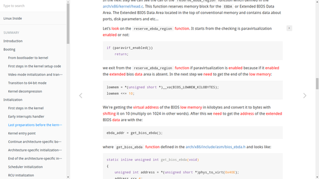

#Keyxtractor (关键字key和提取extractor)

[中文](README_zh.md)

[English](README.md)

基于**TF-IDF** 的关键字提取工具，外加一个chrome插件，旨在提供更佳的web页面阅读体验。

服务端程序+chrome插件

## Server

	server.py [端口]

尽管现在chrome插件暂时不支持修改默认端口

目前服务端程序仅能在本地（localhost）运行，暂且不能部署在计算服务器上。

## Chrome设置

此插件仍在开发阶段，请在chrome://extension中的开发者模式中，手动加载extension目录，以加载该插件。

通过点击Keyxtractor按钮启用高亮功能。

## 语料库

	tfidf_wiki.model	-	TF-IDF 模型
	wiki.dic		-	维基生成的符号的id到文本字典

### 用维基百科的转储生成自定义的语料库
	
	train.py [wiki_dump_files] ...

## 即将到来的新特性!!

0. 更好的分段（我想，也许是密度支持的算法）
1. 个性化的关键字比例（目前，每个段落仅10个关键字被提取，目前你只能在server.py中调整）
2. 更好的分词（将能够分辨词组，如sci-phi，White House，等）
3. 个性化高亮层叠样式表
4. 远程服务器可用的，即可部署的服务端程序。（而不是目前的仅限本地）

## ChangeLog

== 0.2 ==

包含了train.py （现在你可以自定义语料库了）

~~更细粒度的可读区域检测~~ （优化精度）

整词匹配 （优化精度）

分段 （同样是优化精度，通过上下文信息限定）
